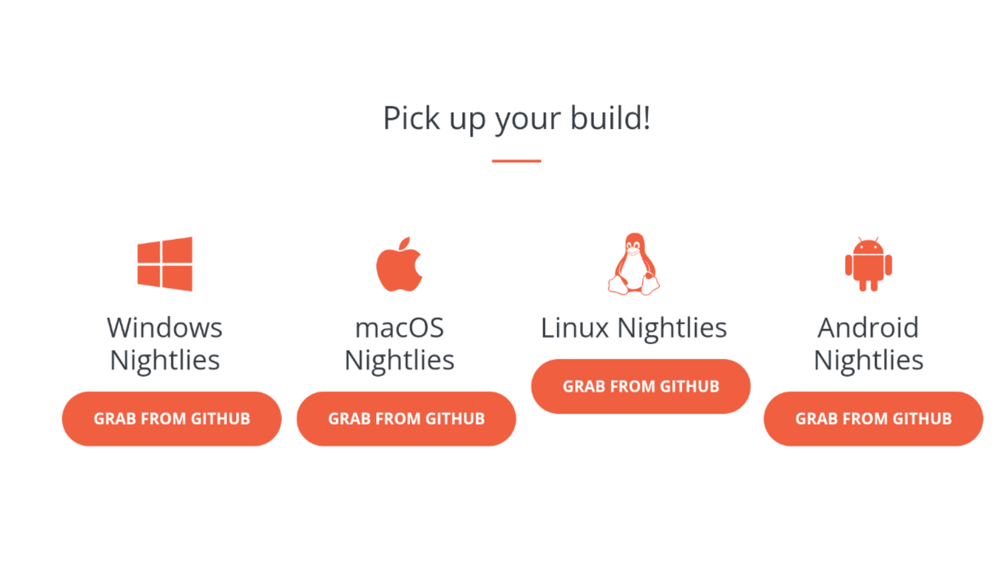
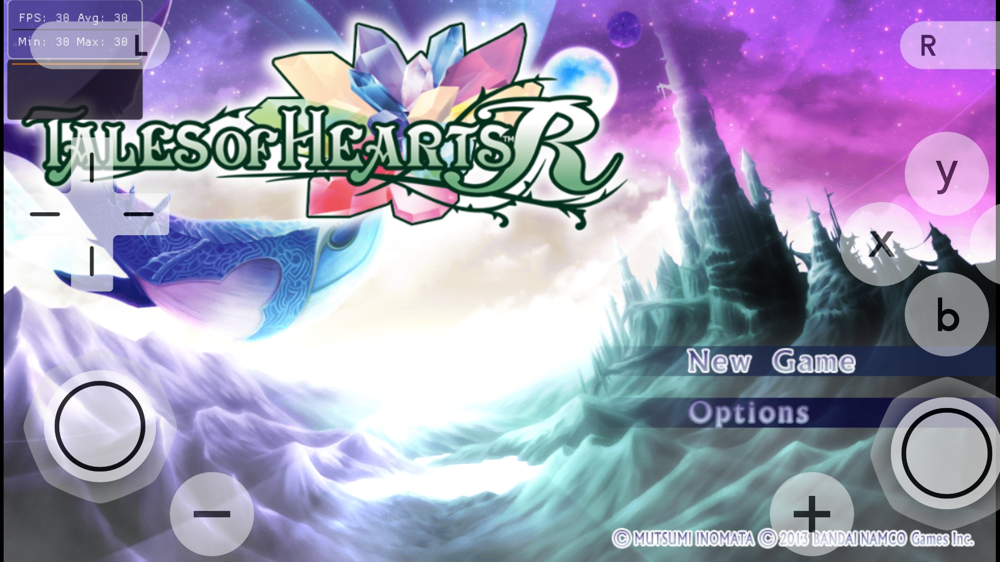
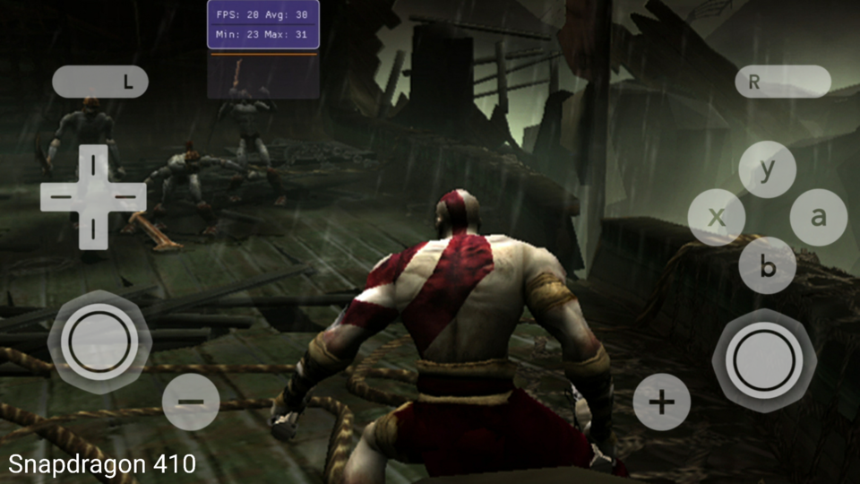

-------

-------
# The fastest PS Vita emulator. More interesting than Vita3K emulator, Dolphin emulator

The fastest PS Vita Emulator for Android in the world! With this software, you can play PS Vita console games on your smartphone. Vita3K emulator can run PS Vita video games smoothly on Snapdragon 4xx and Exynos 7880 smartphone (like Samsung Galaxy A5 2017) and compatible with over 90% of PS Vita games (with a few graphical errors).

------
# Compatibility:
In the game 13914 PS Vita, The PS Vita emulator can run over 90% of PS Vita games (with a small number of graphical errors). And, The Vita3K emulator is fully compatible with over 20% of PS Vita games (the game screen is basically perfect).

-------
# Differences between Free versions:
Important statement: After you purchase the Beta license in the free version of Vita3K, You will enjoy the enhanced features, compared to purchasing a paid download of Vita3K Free on other Google Play Pages, There is no difference between these two pages.

# Of course, you can also use the free version of Vita3K without paying. But the free version has some limitations on functionality. The difference between free and paid is as follows:
* Should you insert ads before the PS Vita game starts?
* Supports SD 720p/480p display.
* Is there gamepad hardware support?
* Is there support for saving game progress with memory card?
* Is there additional support for real-time progress games to store more game progress.
* Support for cheat-code.
v.v ...

------
# We will be releasing updated versions after every 2 ~ 3 weeks. Unlike the Dophin simulation, the PS Vita simulation state is still in its early stages. For more information, please visit our official website.:
• https://www.facebook.com/groups/Vita3K/

• http://www.facebook.com/Vita3K

------
# Features supported:
- Supports 1X enhanced resolution ~ 6X (1080p HD resolution)
- Support for PS All gamepad bluetooth & USB
- Supports bypassing the BIOS boot screen vita
Support multi-thread acceleration
- Supports acceleration of OpenGL 2.0 vector guidance
- Supports many ROM file formats including: VPK format
- Supports memory higher 512MB RAM, 128MB VRAM, 1GB PRAM Phone All Graphics Texture Lower Screen Vita3K Emulator Android
------
# Future support functions:
It will support cheat code.
It will support Frameskip.
- Will support games booted with BIOS
- Will support 16:9 & 18:9
- Will support vibration of HID handle
It will support MIPMAP.
- Support import and export file memory card (PS Vita compatible format)
Supports MEPG2, ARM-v7, Vulkan API
It will support X86.
It will support 95% of PS Vita games to run perfectly.
In the future, For all the different PS Vita games, Vita3K will run 1x faster than the current frame rate ~ 10x.

------
# Hardware Requirements:
- IOS 6.0 +
- Android 7.0 +
- OpenGL ES 2.0 +

------
# Samsung Galaxy A5 2017
# Samsung Galaxy Grand Prime

|                     Tales of Hearts R               |
| :-----------------------------------------------------------: |

|                        God of War and Snapdragon 410                   |

------
# PS Vita Game ROM and BIOS:
Due to the limitations of the law, We will not provide any game ROM and BIOS images to players.

------
# Goals in the future:
After a year, on Snapdragon 450 devices (or Geekbench’s Android phones 4 single-core performance is greater than 1600), Vita3K can run 90% of all PS Vita games near full frame (60FPS+), and Vita3K can run 90% of all ps vita games close to perfect compatibility (No Bugs Display).

Therefore, The best combination of PS emulators on mobile devices is Vulkan emulator and Dolphin emulator. They are the Vita emulator and the GC emulator respectively. Note: The Vulkan emulator is only a PS Vita emulation, not a GC emulator. Vita3K does not integrate Dolphin emulators.

If you want to increase the game's frame rate to 20 ~ 60%, please remove "Thermal Engine" in android system.

----------
If there are grammatical errors in the page or app, please email us immediately. Email: Vita3K@outlook.com .

I hope that many enthusiasts will help us translate Vita3K from English to local language.

----------
Copyright Reserved.

----------
# What's new in the new version? v1.1
Last updated on 25,12.2022

Fixed Graphics Texture\
Fixed Icon Bugs
